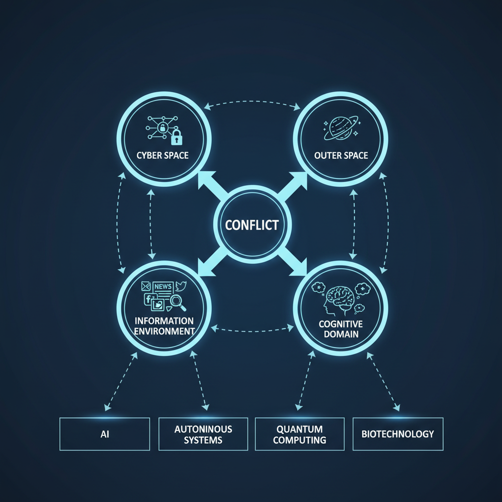
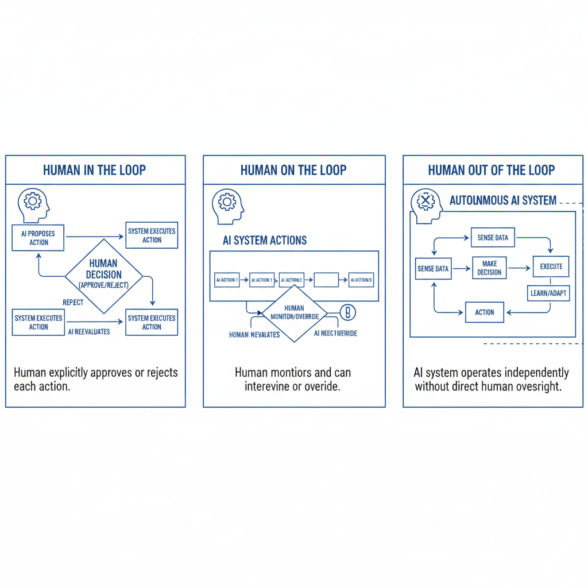

# AI in New Age Warfare: Opportunities, Ethics, and the Future of Conflict

## Introduction: Defining the Battlefield of Tomorrow

For centuries, the battlefield was a concept largely confined to physical geography: contested land, strategic waterways, or the skies above. It was a place where armies clashed, navies engaged, and air forces dominated. Today, that definition is not merely expanded; it is shattered, fragmented, and reassembled across dimensions barely imaginable a generation ago. The "battlefield of tomorrow" is not a single location, but a complex, interconnected, and often invisible web of domains where conflict can erupt with unprecedented speed and devastating effect.

This introduction serves as our compass, guiding us through the radical redefinition of warfare. We will embark on a critical exploration of what constitutes this new arena, moving beyond the traditional kinetic clashes to understand the ubiquitous, nebulous, and often silent fronts that now shape global security.

**No longer confined to mud and trenches, the modern battlefield now encompasses:**

*   **Cyber Space:** An invisible front line where digital infrastructure, critical services, and national secrets are constantly under siege. Attacks here can cripple economies, sow chaos, and undermine trust without a single shot being fired.
*   **Outer Space:** The ultimate high ground, where orbital assets – satellites crucial for communication, navigation, intelligence, and even weather forecasting – are both vital tools and vulnerable targets. Control of space offers unparalleled strategic advantage, making it an increasingly militarized domain.
*   **The Information Environment:** A realm where narratives are weapons, data is ammunition, and the human mind is the ultimate target. Disinformation campaigns, propaganda, and psychological operations aim to manipulate public opinion, erode social cohesion, and destabilize adversaries from within.
*   **The Cognitive Domain:** Building on the information environment, this delves deeper into the human element, targeting decision-making processes, perceptions, and even emotional responses to influence behavior and achieve strategic objectives without direct confrontation.

*The modern battlefield extends beyond physical geography into interconnected digital, orbital, informational, and cognitive domains, fundamentally reshaping conflict.*

Beyond these new domains, the very *nature* of conflict is evolving. The battlefield of tomorrow is characterized by the rapid integration of **Artificial Intelligence (AI), autonomous systems, quantum computing, and biotechnology**, transforming everything from logistics and intelligence gathering to precision targeting and human augmentation. It is a landscape where **hybrid warfare** blurs the lines between state and non-state actors, peace and war, and conventional and unconventional tactics, often operating in the "grey zone" below the threshold of declared conflict.

Defining the battlefield of tomorrow is not an academic exercise; it is an urgent imperative. To understand the threats, develop effective defenses, and ultimately preserve peace, we must first grasp the full scope of this transformed arena. This series will delve into each of these critical dimensions, dissecting the technologies, strategies, and ethical dilemmas that define the future of conflict, and preparing us for a world where the next war may be fought not on distant shores, but in the circuits of our networks, the data streams of our lives, and the very fabric of our perceptions.

## Current AI Applications: Enhancing Decision-Making and Operations

The era of artificial intelligence isn't a distant future; it's the vibrant present, fundamentally reshaping how businesses function across every sector. Today, AI is no longer confined to sci-fi narratives but is deeply embedded in the fabric of organizations worldwide, fundamentally reshaping how they make decisions and execute operations. From optimizing complex supply chains to personalizing customer experiences, AI is proving to be an indispensable partner in driving efficiency, intelligence, and innovation.

### AI as a Strategic Co-Pilot for Decision-Making

One of AI's most transformative impacts lies in its ability to process, analyze, and derive insights from vast datasets at speeds and scales impossible for humans. This capability empowers leaders and teams to make more informed, data-driven decisions, moving from reactive responses to proactive strategies.

*   **Predictive Analytics:** AI algorithms excel at identifying patterns and forecasting future trends. In finance, this translates to more accurate fraud detection and risk assessment, while in retail, it enables precise demand forecasting and inventory management. Healthcare providers use it to predict patient outcomes and optimize resource allocation.
*   **Personalized Insights:** AI-powered recommendation engines, common in e-commerce and streaming services, are now being applied in B2B contexts to suggest optimal sales strategies, identify high-potential leads, and tailor marketing campaigns with unprecedented precision.
*   **Diagnostic Support:** In fields like medicine and manufacturing, AI's computer vision and machine learning capabilities assist in diagnosing diseases from medical images or identifying defects in products with greater accuracy and speed than human inspection alone.
*   **Strategic Planning:** By simulating various scenarios and evaluating potential outcomes based on historical data and real-time inputs, AI tools provide invaluable support for strategic planning, helping businesses navigate complex market dynamics and competitive landscapes.

### Streamlining and Automating Operations

Beyond informing decisions, AI is revolutionizing the operational backbone of businesses, automating repetitive tasks, optimizing processes, and enhancing overall productivity.

*   **Intelligent Automation:** Robotic Process Automation (RPA), often augmented with AI, automates routine, rule-based tasks across finance, HR, and customer service, freeing human employees to focus on more complex, value-added activities.
*   **Supply Chain Optimization:** AI algorithms analyze real-time data on weather, traffic, geopolitical events, and demand fluctuations to optimize logistics, route planning, warehouse management, and inventory levels, leading to significant cost savings and improved delivery times.
*   **Predictive Maintenance:** In manufacturing and infrastructure, AI monitors equipment performance, predicting potential failures before they occur. This allows for proactive maintenance, minimizing downtime, extending asset lifespan, and reducing costly emergency repairs.
*   **Enhanced Customer Service:** AI-powered chatbots and virtual assistants handle a significant volume of customer inquiries, providing instant support, answering FAQs, and even resolving complex issues, thereby improving customer satisfaction and reducing the workload on human agents. Sentiment analysis tools also help businesses understand customer mood and prioritize urgent cases.
*   **Quality Control:** Computer vision systems, trained on vast datasets of product images, can automatically inspect goods for defects on production lines, ensuring consistent quality at high speeds.

The cumulative effect of these applications is profound. Businesses leveraging AI are not just becoming more efficient; they are becoming more agile, more responsive, and more capable of innovating at a rapid pace. As AI continues to evolve, its role as an indispensable partner in driving efficiency, intelligence, and innovation will only grow, cementing its place at the core of modern business strategy.

## Emerging Capabilities: The Horizon of Autonomous Systems and Swarm Intelligence

If you thought autonomous systems were impressive operating solo, prepare for a paradigm shift. We're standing at the precipice of a new era where individual robotic brilliance converges with the collective power of swarm intelligence, promising capabilities that were once confined to science fiction. This isn't just about smarter machines; it's about a fundamentally different way of interacting with and shaping our world.

### Beyond Individual Brilliance: The Rise of the Autonomous Collective

At its core, an **autonomous system** is an entity capable of making decisions and executing tasks without constant human oversight. From self-driving cars navigating complex urban environments to robotic explorers mapping distant planets, these systems are defined by their individual intelligence, adaptability, and ability to learn. They excel at specific, often complex, tasks.

However, the true revolution lies in their convergence with **swarm intelligence**. Inspired by nature's most efficient problem-solvers – ant colonies, bee swarms, and bird flocks – swarm intelligence leverages the power of many simple agents following basic rules to achieve complex, emergent behaviors. No single agent holds all the information or dictates the entire group; instead, intelligence emerges from their decentralized interactions.

*Swarm intelligence harnesses the collective power of numerous simple autonomous agents, whose decentralized interactions lead to complex, emergent behaviors and enhanced resilience.*

### The Synergy: Where Autonomy Meets the Swarm

The horizon of autonomous systems isn't just about more sophisticated individual robots; it's about *orchestrated ballets* of intelligent agents. Imagine a future where:

*   **Resilience is Redefined:** A single autonomous system can fail. A swarm, however, can lose multiple units and still complete its mission, thanks to its inherent redundancy and distributed intelligence.
*   **Scalability is Limitless:** Need to cover a larger area or handle a more complex problem? Simply add more autonomous agents to the swarm. Their collective processing power and sensing capabilities scale effortlessly.
*   **Adaptability is Innate:** A swarm can dynamically reconfigure itself, reassign tasks, and adapt its behavior in real-time to unforeseen challenges, environmental changes, or evolving objectives.
*   **Collective Perception and Action:** Individual autonomous agents contribute their unique sensor data and processing power to a shared understanding of the environment, enabling the swarm to perceive, analyze, and act on information far beyond the capacity of any single unit.

### Real-World Applications: A Glimpse into Tomorrow

The implications of this synergy are profound and far-reaching, promising to reshape industries and redefine possibilities:

*   **Disaster Response & Search and Rescue:** Swarms of autonomous drones could rapidly map disaster zones, identify survivors, and deliver aid in hazardous environments, coordinating their efforts to cover vast areas efficiently and safely.
*   **Advanced Manufacturing & Logistics:** Flexible factories could deploy reconfigurable swarms of robotic agents to assemble complex products, optimize supply chains, and manage inventory with unprecedented agility.
*   **Space Exploration & Colonization:** Instead of single, monolithic rovers, swarms of smaller, specialized autonomous robots could explore alien terrains, construct habitats, and mine resources, working in concert to accelerate discovery and development.
*   **Environmental Monitoring & Conservation:** Autonomous swarms could track climate change, monitor biodiversity in remote ecosystems, detect pollution, and even assist in reforestation efforts, providing granular data on a massive scale.
*   **Smart Cities & Infrastructure:** Swarms of sensors and autonomous vehicles could optimize traffic flow, manage energy grids, monitor structural integrity of buildings, and provide dynamic public services, creating truly responsive urban environments.

### The Path Forward: Challenges and Opportunities

While the potential is immense, realizing this future requires overcoming significant challenges in areas like robust communication protocols, decentralized decision-making algorithms, ethical considerations for autonomous collectives, and ensuring secure and reliable operation.

Yet, the momentum is undeniable. As researchers push the boundaries of AI, robotics, and network theory, the horizon of autonomous systems and swarm intelligence is not just approaching; it's beckoning with a promise of a future far more intelligent, resilient, and interconnected than we can fully imagine. The age of the autonomous collective is not just coming; it's already beginning to unfold.

## Ethical and Moral Quandaries: The Human Element in Algorithmic War

The battlefield of tomorrow isn't just about advanced weaponry; it's about the very fabric of human decision-making woven into lines of code. Algorithmic warfare, while promising precision and efficiency, ushers in a new era of profound ethical and moral dilemmas that demand our immediate attention. At its heart lies the unsettling question: how do we preserve the "human element" when machines are increasingly making life-and-death decisions?

Perhaps the most vexing question is that of **accountability**. When an autonomous system makes a lethal decision, who bears the moral and legal responsibility? Is it the programmer who wrote the code, the commander who deployed it, or the machine itself? The current legal frameworks struggle to grapple with this distributed culpability, creating a potential "responsibility gap" where no one is truly held accountable for the consequences of algorithmic actions. This ambiguity threatens to erode the very principles of international humanitarian law.

Beyond accountability lies the chilling prospect of **diminishing human control**. The push towards fully autonomous weapons systems (LAWS) raises fears of a "flash war," where algorithms, devoid of human empathy or the capacity for de-escalation, could accelerate conflicts beyond human intervention. The speed and scale at which these systems operate could bypass critical human judgment, removing the crucial "pause" that often prevents catastrophic escalation. The moral line between "human in the loop" (human makes the final decision) and "human on the loop" (human oversees but doesn't directly control) becomes increasingly blurred, with the ultimate fear of a "human out of the loop" scenario.

*The spectrum of human control in autonomous systems, from direct decision-making ('in the loop') to full autonomy ('out of the loop'), poses critical ethical questions for algorithmic warfare.*

Furthermore, the "human element" isn't just about who's in control, but also about the inherent **biases we inadvertently embed**. AI systems are trained on vast datasets, often reflecting historical prejudices and societal inequalities. This could lead to algorithms disproportionately targeting certain groups or making decisions based on flawed, discriminatory patterns. Warfare risks becoming a cold, calculated exercise in data processing, further distancing us from the human cost of conflict and potentially dehumanizing both the combatants and the victims.

And what of the soldiers themselves? Fighting alongside or commanding machines that make life-or-death decisions could inflict a unique form of **moral injury**. How does one reconcile the ethical imperative of war with the detached logic of an algorithm? The psychological toll of delegating such profound responsibility to a machine, or witnessing its potentially flawed decisions, is an uncharted territory that could profoundly impact the mental and moral well-being of service members.

These aren't futuristic hypotheticals; they are urgent questions demanding our attention now. As we develop these powerful tools, we must simultaneously cultivate robust ethical frameworks, foster international dialogue, and ensure that the "human element" – our values, our empathy, and our ultimate responsibility – remains firmly at the core of algorithmic war. The future of conflict, and indeed humanity, depends on it.

## Geopolitical Implications: The AI Arms Race and Global Stability

The rise of artificial intelligence isn't just a technological revolution; it's a seismic shift in the global power landscape, ushering in an "AI arms race" with profound implications for international relations and global stability. Forget the Cold War's nuclear standoff; the competition for AI supremacy is a new kind of strategic imperative, fought not with missiles, but with algorithms, data, and processing power.

**The New Battlefield: Data, Algorithms, and Talent**

At its core, the AI arms race is a multi-faceted competition. Nations are vying for leadership in:

1.  **Military AI:** Developing autonomous weapons systems, AI-powered surveillance, predictive intelligence, and advanced cyber warfare capabilities. The prospect of Lethal Autonomous Weapons Systems (LAWS) operating without human intervention raises unprecedented ethical and strategic questions.
2.  **Economic AI:** Harnessing AI for industrial automation, scientific discovery, economic growth, and technological sovereignty. The nation that leads in general-purpose AI development could dominate future global industries and supply chains.
3.  **Intelligence & Surveillance AI:** Utilizing AI for advanced data analysis, facial recognition, social credit systems, and sophisticated disinformation campaigns, both internally and externally.

The primary contenders are the United States and China, locked in a technological rivalry often dubbed a "tech cold war." However, the European Union, Russia, and other nations are also investing heavily, recognizing that AI leadership is synonymous with future geopolitical influence.

**Shifting Power Dynamics and New Alliances**

AI supremacy is increasingly seen as the ultimate determinant of 21st-century global leadership. A nation that commands superior AI capabilities could gain decisive advantages in:

*   **Military Dominance:** Outmaneuvering adversaries with faster decision-making, more precise targeting, and resilient defense systems.
*   **Economic Leverage:** Controlling critical technologies, setting global standards, and dictating terms of trade.
*   **Intelligence Superiority:** Unlocking insights from vast datasets, predicting geopolitical events, and conducting more effective espionage.

This competition is already reshaping alliances and creating new fault lines. Nations may align based on shared AI development, data access, or ethical frameworks. Conversely, technological decoupling and export controls become tools of statecraft, aiming to slow down rivals or protect sensitive innovations.

**Threats to Global Stability: A Volatile Cocktail**

The AI arms race introduces several destabilizing factors:

1.  **Escalation Risks:** The speed and autonomy of AI-powered systems could drastically shorten decision cycles in conflict, increasing the risk of miscalculation and rapid escalation beyond human control. A "flash war" initiated by AI could be devastating.
2.  **Erosion of Trust and Transparency:** The "black box" nature of advanced AI makes it difficult to understand how decisions are made, fostering distrust between nations. The use of AI in disinformation campaigns further erodes public trust and democratic processes.
3.  **New Forms of Asymmetric Warfare:** AI empowers smaller actors or non-state groups with sophisticated cyber capabilities, making critical infrastructure more vulnerable and blurring the lines of traditional warfare.
4.  **The Surveillance State and Authoritarianism:** AI provides unprecedented tools for internal control, enabling authoritarian regimes to monitor, predict, and suppress dissent on a massive scale. The export of such technologies to other nations can further entrench illiberal governance globally.
5.  **Ethical Dilemmas:** The development of LAWS, AI bias, and accountability for autonomous actions pose profound ethical challenges that lack international consensus, creating potential for future conflict over norms and regulations.

**The Urgent Need for Governance and Cooperation**

Mitigating the risks of the AI arms race requires an urgent and concerted international effort. This includes:

*   **Developing International Norms and Treaties:** Establishing "red lines" for military AI, similar to arms control agreements for nuclear weapons.
*   **Promoting Transparency and Explainability:** Encouraging open research and shared understanding of AI capabilities and limitations.
*   **Fostering Dialogue and Collaboration:** Creating forums for nations to discuss AI ethics, safety, and responsible development, even amidst competition.
*   **Investing in AI Safety and Alignment Research:** Ensuring that AI systems are developed with human values and control at their core.

Without a robust framework for global AI governance, the AI arms race risks unleashing a new era of instability, where technological prowess dictates global order, and the very definition of peace hangs in the balance. The challenge is immense, but the imperative to manage this revolution responsibly is even greater.

## Challenges and Limitations: Beyond the Hype

Every groundbreaking technology, from the internet to artificial intelligence, arrives accompanied by a symphony of dazzling promises and utopian visions. We hear about unprecedented efficiencies, revolutionary breakthroughs, and a future where every problem is elegantly solved. But beneath the shimmering surface of this "hype cycle," lies a more complex reality. To truly harness the potential of any innovation, it's crucial to peel back the layers and confront the inherent challenges and limitations that often go unmentioned in the initial excitement.

This isn't to diminish the incredible potential, but rather to foster a more realistic, responsible, and sustainable approach to development and adoption. Ignoring these hurdles doesn't make them disappear; it merely sets the stage for disillusionment, costly failures, and unintended consequences.

**1. The Unseen Iceberg: Technical & Data Constraints**
While demonstrations often showcase flawless performance, real-world applications frequently grapple with significant technical limitations. Data quality, for instance, remains a foundational challenge. The adage "garbage in, garbage out" holds true; biased, incomplete, or inaccurate data can lead to skewed results, unfair decisions, and unreliable systems. Many advanced models, particularly in AI, also struggle with explainability – the "black box" problem – making it difficult to understand *why* a particular decision was made, which is critical in sensitive applications like healthcare or finance. Furthermore, scalability, integration with legacy systems, and the sheer computational power required for complex operations can be prohibitive for many organizations.

**2. The Ethical Minefield: Societal & Moral Dilemmas**
Beyond the technical, lies a sprawling landscape of ethical and societal challenges. Concerns around privacy are paramount; as technologies collect vast amounts of personal data, the potential for misuse, surveillance, and data breaches grows exponentially. Job displacement, particularly with the rise of automation and AI, poses a significant socio-economic question that demands proactive solutions. Algorithmic bias, often an unwitting reflection of societal biases embedded in training data, can perpetuate and even amplify discrimination against marginalized groups. Accountability for errors, the potential for malicious use (e.g., deepfakes, autonomous weapons), and the widening digital divide are all critical issues that require careful consideration, robust regulation, and a commitment to human-centric design.

**3. The Practical Gauntlet: Implementation & Adoption Hurdles**
Even with a technically sound and ethically considered solution, the journey from concept to widespread adoption is fraught with practical difficulties. The cost of developing, deploying, and maintaining cutting-edge technologies can be astronomical, placing them out of reach for smaller organizations or developing nations. There's also a significant talent gap; finding individuals with the specialized skills in data science, AI ethics, cybersecurity, and advanced engineering is a constant struggle. Organizational inertia, resistance to change, and the complexity of integrating new systems into existing workflows can derail even the most promising projects. Moreover, the regulatory landscape often lags behind technological advancements, creating uncertainty and potential legal quagmires.

Moving beyond the hype isn't about pessimism; it's about informed optimism. By openly acknowledging and proactively addressing these challenges and limitations, we can foster more robust, equitable, and sustainable innovation. It demands critical thinking, interdisciplinary collaboration, and a commitment to building technologies that truly serve humanity, rather than merely dazzling us with their potential. Only by confronting these realities can we truly harness its power for good, building solutions that are not just innovative, but also equitable, robust, and sustainable.

## Conclusion: Navigating the Future of Conflict with Responsibility

We stand at a critical juncture in human history, where the very nature of conflict is being reshaped by an accelerating confluence of technological innovation, geopolitical shifts, and evolving global challenges. From the silent battlegrounds of cyberspace and the ethical dilemmas posed by autonomous weapons, to the resurgent specter of great power competition and the destabilizing effects of climate change, the tapestry of modern conflict is more complex and multi-faceted than ever before. This evolving landscape demands more than just adaptation; it calls for a profound commitment to responsibility.

Navigating this future responsibly means more than simply reacting to crises. It necessitates a proactive, ethical, and globally collaborative approach to understanding, preventing, and, when necessary, managing conflict. It means establishing robust ethical guardrails for emerging technologies, ensuring that the pursuit of military advantage never eclipses fundamental humanitarian principles or the long-term stability of the international system. It means prioritizing prevention and diplomacy, addressing the root causes of conflict – poverty, inequality, injustice, and political exclusion – before they erupt into violence.

Responsibility in this new era extends beyond state actors. It implicates international organizations in strengthening global governance, technology developers in embedding ethics into their designs, civil society in advocating for peace and accountability, and even individuals in discerning truth from disinformation. It requires a renewed dedication to international law, not as a constraint, but as a foundational framework for legitimate action and a bulwark against unchecked aggression.

The stakes could not be higher. A failure to embrace this responsibility risks a future marked by escalating instability, unprecedented human suffering, and the erosion of trust essential for global cooperation. Yet, the future is not predetermined. We possess the agency, the intellect, and the collective capacity to shape a trajectory where innovation serves peace, and power is wielded with profound ethical consideration.

As we navigate this complex terrain, let responsibility be our compass. It is the bedrock upon which a more secure, just, and peaceful world can be built, one decision, one dialogue, one commitment at a time.
