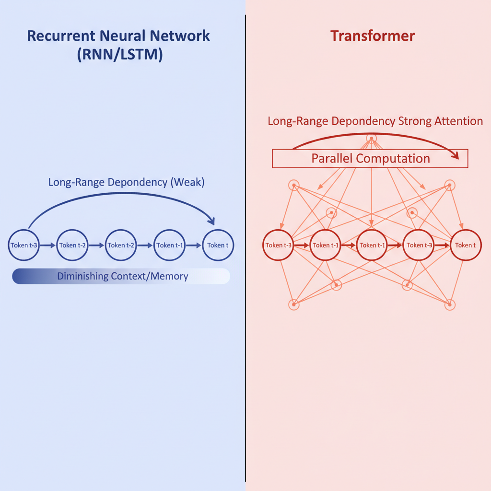
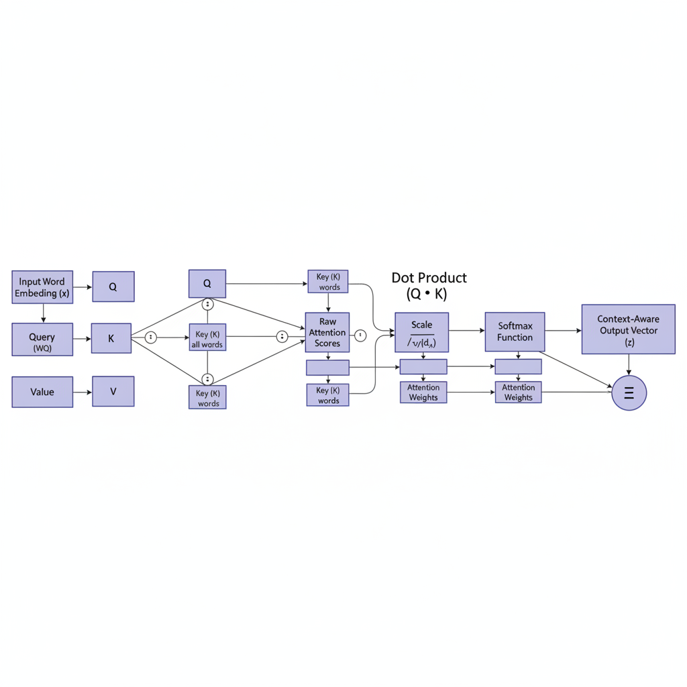
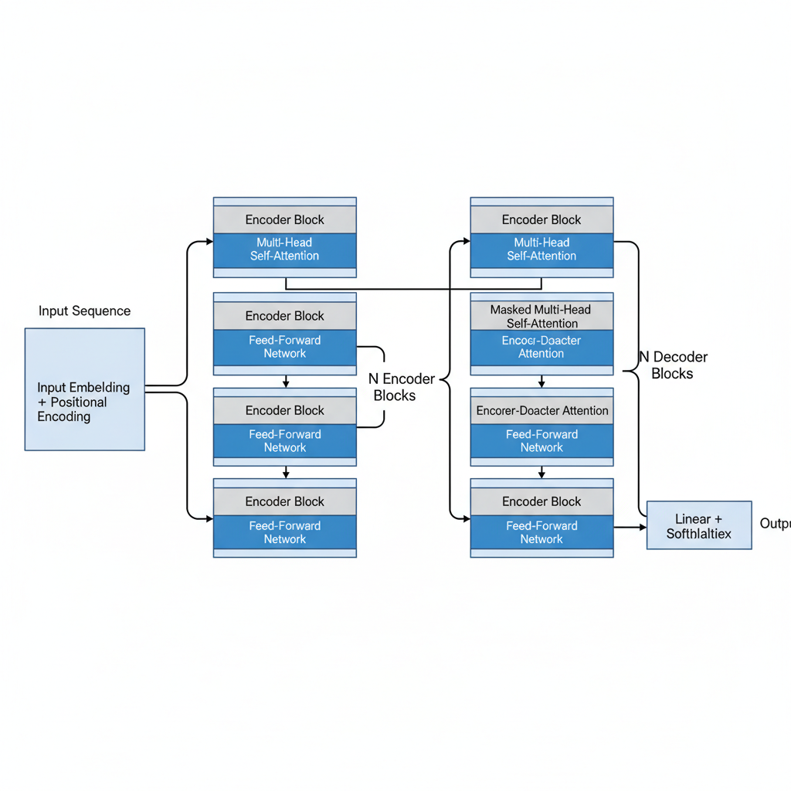

# Understanding the Transformer Architecture: The Foundation of Modern AI

## Introduction: The Rise of Transformers

In the rapidly evolving landscape of Artificial Intelligence, few innovations have sparked as much excitement and transformation as the Transformer architecture. It's not an exaggeration to say that if you've been impressed by AI's capabilities in recent years – from the conversational prowess of ChatGPT to the stunning image generation of DALL-E – you've witnessed the power of Transformers in action.

Emerging from a groundbreaking 2017 paper by Google researchers titled "Attention Is All You Need," Transformers weren't just another incremental improvement; they were a paradigm shift. Before their advent, recurrent neural networks (RNNs) and LSTMs were the go-to for processing sequential data like language. However, these architectures struggled with long-range dependencies (remembering information from far earlier in a sequence) and were inherently sequential, making parallel processing difficult and slow.

The Transformer's genius lies in its "self-attention" mechanism. This revolutionary concept allows the model to weigh the importance of different parts of the input sequence relative to each other, regardless of their position. Imagine reading a sentence and instantly understanding how each word relates to every other word, even if they're far apart – that's essentially what self-attention enables. This breakthrough allowed for unprecedented parallelization, dramatically speeding up training times and enabling models to process much longer sequences of data.

The result? A dramatic leap in performance across a multitude of tasks. Transformers have fundamentally reshaped Natural Language Processing (NLP), becoming the bedrock for state-of-the-art machine translation, text summarization, question answering, and, of course, the large language models (LLMs) that have captured global attention. Their influence has even extended beyond text, making significant waves in computer vision and multimodal AI.

More than just a technical marvel, the rise of Transformers has democratized access to highly sophisticated AI capabilities, pushing the boundaries of what machines can understand, generate, and learn.

In this blog series, we'll embark on a journey to demystify the Transformer. We'll explore its core components, understand the magic of attention, delve into its diverse applications, and ponder the exciting future it promises for artificial intelligence. Get ready to understand the architecture that's reshaping our world.

## The Pre-Transformer Landscape: Limitations of Sequential Models

Before the reign of the Transformer, the world of Natural Language Processing (NLP) and sequence modeling was largely dominated by a family of architectures known as **Recurrent Neural Networks (RNNs)**, and their more sophisticated cousins, **Long Short-Term Memory (LSTMs)** networks and **Gated Recurrent Units (GRUs)**. These models revolutionized our ability to process sequential data, from predicting the next word in a sentence to understanding the sentiment of a review. They did so by maintaining an internal "hidden state" that was updated at each step, theoretically allowing them to remember information from previous inputs.

However, beneath their impressive capabilities, these sequential models harbored several inherent limitations that ultimately paved the way for a new paradigm. Understanding these challenges is crucial to appreciating the breakthrough that the Transformer represented.

*A visual comparison highlighting the sequential bottleneck of RNNs/LSTMs versus the parallel processing and direct long-range dependency handling of the Transformer's attention mechanism.*

### 1. The Sequential Bottleneck: No Parallelization

The most fundamental limitation of RNNs, LSTMs, and GRUs lies in their very nature: they process information **sequentially, token by token**. To compute the hidden state at time `t`, you *must* have computed the hidden state at time `t-1`. This dependency creates a significant bottleneck:

*   **Slow Training:** Training these models, especially on long sequences, is inherently slow because computations cannot be parallelized across the sequence length. Each step must wait for the previous one to complete.
*   **Inefficient for Modern Hardware:** This sequential processing is at odds with the parallel processing power of modern GPUs, which excel at performing many independent computations simultaneously.

### 2. The Long-Range Dependency Problem (Vanishing/Exploding Gradients)

While LSTMs and GRUs were specifically designed to mitigate the notorious **vanishing and exploding gradient problems** that plagued vanilla RNNs, they didn't entirely solve the issue of capturing **long-range dependencies**.

*   **The "Forgetfulness" Factor:** Even with their sophisticated gating mechanisms, LSTMs and GRUs still struggle to effectively remember information from the very beginning of a very long sequence when predicting something much later. Imagine trying to recall a specific detail from the first paragraph of a lengthy article while reading the last one – the signal often degrades over distance.
*   **Information Bottleneck:** The hidden state, while carrying information, is a fixed-size vector. As the sequence grows, this vector becomes an increasingly compressed and lossy representation of all past information, making it difficult to selectively retrieve specific, relevant details from far back in the sequence.

### 3. Fixed-Size Context and Lack of Global Understanding

Sequential models process input one step at a time, building a context incrementally. They don't inherently "see" the entire sequence at once to understand the relationships between all its parts.

*   **No Direct Relationships:** If a word at the beginning of a sentence is highly relevant to a word at the end, an LSTM has to propagate that information through every intermediate step. It cannot directly establish a strong connection or "attend" to that distant, relevant word without traversing the entire path.
*   **Limited Context Window:** While LSTMs extend the effective context window, it's still an implicit, compressed representation. They lack a mechanism to dynamically weigh the importance of different past inputs when making a decision at the current step.

### 4. Computational Inefficiency for Very Long Sequences

The combination of sequential processing and the need to maintain and update a hidden state for every token meant that processing and training on extremely long sequences (e.g., entire documents, long audio clips) became computationally prohibitive. The memory and time requirements scaled linearly with sequence length, making many real-world applications impractical.

Cumulatively, these limitations highlighted a critical need for a new architecture that could process sequences more efficiently, capture long-range dependencies more effectively, and understand global relationships within the data. The stage was set for a model that could break free from the sequential chain – a model that would introduce the power of self-attention.

## The Core Innovation: Self-Attention Mechanism

If there's one single mechanism that truly revolutionized the field of Natural Language Processing and paved the way for the large language models we see today, it's the **Self-Attention Mechanism**. Before its advent, models like Recurrent Neural Networks (RNNs) and Long Short-Term Memory (LSTMs) struggled with a fundamental challenge: understanding the context of words across long sentences. They processed information sequentially, often forgetting crucial details from the beginning of a text by the time they reached the end.

**Enter Self-Attention: A Brilliant Solution to Contextual Understanding**

Self-attention is a mechanism that allows a model to weigh the importance of different words in an input sequence when encoding a specific word. Instead of processing words one by one, it enables each word to "look at" and "pay attention" to all other words in the sequence simultaneously, dynamically determining their relevance.

**How Does It Work (Conceptually)?**

Imagine each word in a sentence is a delegate at a committee meeting. When a specific delegate (our "target word") needs to understand its role and meaning, it doesn't just listen to the delegate next to it. Instead, it:

1.  **Queries** all other delegates: "How relevant are you to my current understanding?" (This is the **Query** vector).
2.  Each other delegate then responds with a **Key**: "Here's what I represent, judge my relevance." (This is the **Key** vector).
3.  The target word then calculates an "attention score" for every other delegate based on how well their Key aligns with its Query.
4.  These scores are then normalized (often using a softmax function) to create a set of weights, indicating how much "attention" to pay to each word.
5.  Finally, each delegate also provides a **Value**: "Here's the actual information I carry." (This is the **Value** vector). The target word then combines these Values, weighted by the attention scores, to form its new, context-rich representation.

This process happens for *every word* in the sequence, in parallel, allowing each word to build a rich, context-aware representation by selectively focusing on the most relevant parts of the input.

*The core of self-attention: how Query, Key, and Value vectors interact to compute attention scores and produce a context-aware output for a single word.*

**Why Is It a Game-Changer?**

*   **Long-Range Dependencies:** Self-attention excels at capturing relationships between words that are far apart in a sentence, overcoming the "forgetting" problem of previous models.
*   **Parallelization:** Unlike sequential RNNs, self-attention can be computed in parallel for all words, drastically speeding up training times and enabling the use of much larger datasets.
*   **Dynamic Context:** The context for each word isn't fixed; it's dynamically calculated based on its interaction with every other word, leading to a much more nuanced understanding.
*   **Interpretability (to a degree):** The attention scores can sometimes offer insights into which parts of the input the model is focusing on, providing a window into its decision-making.

The self-attention mechanism is the beating heart of the Transformer architecture, which in turn is the foundational block for virtually all modern large language models (LLMs) like GPT-3, BERT, and their successors. It's not just an algorithm; it's a paradigm shift that unlocked unprecedented capabilities in understanding and generating human language.

## Positional Encoding: Injecting Order into Sequences

The Transformer architecture, with its revolutionary self-attention mechanism, changed the game for sequence processing. It allowed models to weigh the importance of every word in relation to every other word, regardless of their distance. This parallel processing power was a huge leap forward from sequential models like LSTMs.

But there's a catch.

Transformers, by their very nature, are **permutation-invariant**. This means if you shuffle the words in a sentence, the self-attention mechanism would still process them in the exact same way, treating "Dog bites man" identically to "Man bites dog." Clearly, for language understanding, order is everything. Without it, a sequence of words is just a bag of words, devoid of meaning, grammar, or context.

This is where **Positional Encoding** steps in – the unsung hero that gives the Transformer its sense of sequence.

### What is Positional Encoding?

At its core, Positional Encoding is a clever mechanism to inject information about the *position* of each element (like a word or a token) within a sequence, without altering the words themselves. Think of it like adding a tiny, unique "address tag" to each word.

These positional "tags" are then added directly to the word embeddings (the numerical representations of the words). So, instead of the model just seeing the embedding for "dog," it sees the embedding for "dog" *plus* its positional encoding for "first word." This subtle addition is enough to give the model the crucial spatial awareness it needs.

### How Does It Work? (The Sinusoidal Secret)

While there are different approaches, the original Transformer introduced a brilliant one using **sinusoidal functions** (sine and cosine waves). Here's why it's so ingenious:

1.  **Unique Representation:** Each position in the sequence (from 0 to the maximum possible length) gets a unique, high-dimensional vector. No two positions have the exact same positional encoding.
2.  **Relative Position Awareness:** Crucially, these vectors are designed so that the model can easily infer *relative positions*. For example, the difference between the positional encoding for position `i` and position `i+1` is consistent, regardless of where `i` is in the sequence. This means the model can learn that "the word after X" has a specific relationship to X, without needing to memorize every absolute position.
3.  **Generalization:** Because it uses mathematical functions, the model can generate positional encodings for sequences longer than it has ever seen during training. It doesn't need to learn a fixed embedding for every possible position; it can calculate it on the fly.

Imagine each word not only knowing its own address but also having a built-in compass that tells it how far and in what direction it is from its neighbors. This is the power of sinusoidal positional encoding.

### Why It Matters

Without Positional Encoding, the Transformer would be blind to order. A sentence like "The cat chased the mouse" would be indistinguishable from "The mouse chased the cat." It's what allows the Transformer to grasp grammar, syntax, and the flow of information that defines human language.

Positional Encoding isn't just an add-on; it's the invisible hand that guides the Transformer's attention, giving meaning to the sequence, transforming a bag of words into a coherent narrative. It's a foundational component that truly unlocked the Transformer's full potential, enabling it to excel at tasks from machine translation to text generation and beyond.

## The Encoder Block: Processing Input Sequences

If the Transformer is a revolutionary language model, then the Encoder Block is its keen-eyed reader, meticulously processing every word and understanding its context within a given text. It's the engine responsible for taking your raw input (like a sentence or a document) and transforming it into a rich, contextualized numerical representation that the rest of the model can work with.

Imagine you're trying to understand a complex paragraph. You don't just read words in isolation; you consider how each word relates to the others, what came before, and what comes after. The Encoder Block does precisely this, but at a massive, mathematical scale.

### The Journey Begins: From Words to Vectors

Before a sequence even enters an Encoder Block, a couple of crucial steps happen:

1.  **Tokenization:** The input text is broken down into smaller units called "tokens" (which can be words, sub-words, or characters).
2.  **Embedding:** Each token is converted into a numerical vector, an "embedding," that captures some initial semantic meaning.
3.  **Positional Encoding:** Since the Transformer processes words in parallel without inherent sequential understanding, "positional encodings" are added to these embeddings. These special vectors give the model a sense of the order of words in the sequence.

Now, with these position-aware word embeddings, they are ready to enter the heart of the Encoder Block.

### Inside the Encoder Block: A Two-Part Symphony

Each Encoder Block is primarily composed of two sub-layers, each followed by a "residual connection" and "layer normalization":

#### 1. The Multi-Head Self-Attention Mechanism (The Maestro)

This is arguably the most innovative and powerful component. Its job is to help the model understand the relationships between different words in the input sequence.

*   **Understanding Context:** For every word, self-attention looks at all other words in the input sequence and assigns a "weight" or "importance score" based on how relevant they are to understanding the current word. For example, in "The bank of the river," self-attention helps the model understand that "bank" refers to a riverbank, not a financial institution, by paying more attention to "river."
*   **Query, Key, Value:** Each word's embedding generates three distinct vectors: a **Query** (what am I looking for?), a **Key** (what do I have?), and a **Value** (what information do I carry?). Self-attention calculates similarity between Queries and Keys to determine attention weights, which are then applied to the Values to create a new, context-aware representation for each word.
*   **Multi-Head Magic:** Instead of just one attention mechanism, "Multi-Head" attention runs this process multiple times in parallel, each with different learned linear transformations. This allows the model to capture different types of relationships and focus on various aspects of the input simultaneously, enriching its understanding.

After the self-attention layer, the output is combined with its original input (the residual connection) and then normalized (layer normalization) to stabilize training and ensure consistent scales.

#### 2. The Position-Wise Feed-Forward Network (The Refiner)

Following the self-attention layer, the data passes through a simple, fully connected feed-forward network.

*   **Independent Processing:** Unlike self-attention, which considers the entire sequence, this network acts independently on each position (word) in the sequence. It's like a small, separate neural network applied to each word's contextualized vector.
*   **Introducing Non-Linearity:** This network typically consists of two linear transformations with a non-linear activation function (like ReLU) in between. Its purpose is to further process the information, introduce non-linearity, and allow the model to learn more complex patterns from the self-attention output.

Again, this sub-layer's output is combined with its input via a residual connection and then normalized.

### Stacking for Depth

A single encoder block provides a foundational level of understanding, but real-world language is complex. That's why Transformers typically **stack multiple identical encoder blocks** on top of each other. Each subsequent block takes the output of the previous one as its input, allowing the model to build progressively deeper and more abstract representations of the input sequence. The first blocks might capture syntactic relationships, while later blocks might understand more complex semantic nuances.

### The Output: Contextualized Embeddings

The final output of the entire encoder stack is a sequence of **contextualized vectors**. Each vector in this sequence corresponds to an input token, but now it's no longer just a simple word embedding. It's a rich, dense representation that encapsulates not only the word's inherent meaning but also its meaning in the specific context of the entire input sequence, considering its relationships with every other word.

These highly informative, context-aware embeddings are then passed on to the Decoder Block (in sequence-to-sequence tasks) or directly to a classification head (for tasks like sentiment analysis or text classification), ready for the next stage of processing.

## The Decoder Block: Generating Output Sequences

If the encoder is the diligent student who meticulously reads and understands the input text, the **decoder block** is the eloquent translator, taking that understanding and crafting a coherent, contextually relevant output sequence. This is where the magic of generation happens, transforming abstract representations into tangible words, sentences, or even code.

Unlike the encoder, which processes its entire input simultaneously, the decoder operates in an **autoregressive** fashion. Think of it like writing a sentence one word at a time: you decide on the first word, then use that word (and all previous context) to decide on the second, and so on. The decoder block is designed to mimic this sequential generation process, ensuring that each new token is predicted based on all the tokens that came before it in the output sequence, as well as the comprehensive understanding provided by the encoder.

Let's break down the key components within a single decoder block:

1.  **Masked Multi-Head Self-Attention:**
    *   This is the decoder's unique twist on self-attention. While the encoder's self-attention can look at all other tokens in its input, the decoder's self-attention is **masked**. This means that when the decoder is predicting the *n*-th token in the output sequence, it can *only* attend to tokens *1 through n-1* that it has *already generated*. It cannot "cheat" by looking at future tokens in the target sequence. This masking is crucial for maintaining the autoregressive property and simulating real-world generation.
    *   Just like in the encoder, "multi-head" allows the model to simultaneously attend to different parts of the already-generated sequence, capturing various relationships and nuances.

2.  **Encoder-Decoder Attention (Cross-Attention):**
    *   This is the bridge between the encoder's understanding and the decoder's generation. Here, the decoder's queries (representing its current state of generation) attend to the keys and values produced by the *encoder's final layer*.
    *   Essentially, the decoder asks: "Given what I'm trying to generate, what parts of the *input sequence* are most relevant right now?" This mechanism allows the decoder to focus on specific parts of the input context that are most pertinent to predicting the next output token, ensuring the output is grounded in the input's meaning.

3.  **Feed-Forward Network:**
    *   Following the two attention layers, the output passes through a position-wise fully connected feed-forward network, identical in structure to the one in the encoder. This network further processes and transforms the information, adding non-linearity and allowing the model to learn complex patterns.

**The Autoregressive Dance: How Output Sequences Are Generated**

The true magic of the decoder block comes alive when multiple blocks are stacked and used in an iterative process:

1.  **Start Token:** The generation begins by feeding a special `[START]` token into the first decoder block.
2.  **First Prediction:** The decoder stack processes this `[START]` token, attends to the encoder's output, and through a final linear layer and softmax function (applied *after* the stack of decoder blocks), predicts a probability distribution over the entire vocabulary for the *next* token. The token with the highest probability (or chosen via more sophisticated sampling methods like beam search) is selected.
3.  **Iterative Loop:** This newly predicted token is then appended to the input sequence for the *next* decoding step. The decoder now takes `[START] + [Predicted Token 1]` as its input, and predicts `[Predicted Token 2]`.
4.  **End Condition:** This process continues, token by token, until the decoder predicts a special `[END]` token, signaling the completion of the output sequence.

In essence, the decoder block is a sophisticated feedback loop. It continuously refines its understanding of what it has already generated, cross-references it with the encoder's comprehensive input context, and then predicts the most probable next step in the output sequence, bringing the model's understanding to life in a generated form.

*An overview of the Transformer architecture, illustrating the flow from input embeddings and positional encodings through stacked Encoder blocks, to the Decoder blocks that generate the output sequence, highlighting the cross-attention mechanism.*

## Key Advantages and Broad Impact of Transformers

At the heart of the current AI revolution lies a groundbreaking architecture: the Transformer. More than just an incremental improvement, Transformers represent a paradigm shift in how machines process and understand complex data, offering a suite of advantages that have propelled artificial intelligence into unprecedented territory.

### The Core Advantages: Why Transformers Excel

1.  **Unprecedented Contextual Understanding (Self-Attention):** Unlike their predecessors (like RNNs and LSTMs) that processed information sequentially, Transformers leverage a mechanism called "self-attention." This allows the model to weigh the importance of every other word (or data point) in the input sequence when processing a single one. The result is an unparalleled ability to grasp long-range dependencies and nuanced contextual meanings, making them incredibly adept at tasks requiring deep comprehension.

2.  **Parallelization and Efficiency:** A critical limitation of sequential models was their inability to process data in parallel, leading to slow training times, especially with large datasets. The self-attention mechanism, however, can be computed simultaneously for all parts of the input. This massive parallelization drastically reduces training times on modern hardware (GPUs, TPUs), making it feasible to train models on truly colossal datasets.

3.  **Transfer Learning and Adaptability:** Perhaps one of their most profound advantages is their suitability for transfer learning. Transformers can be pre-trained on vast, general datasets (e.g., the entire internet for language models) to learn fundamental patterns and representations. This pre-trained model can then be fine-tuned with relatively small, task-specific datasets to achieve state-of-the-art performance, democratizing access to powerful AI capabilities without needing immense amounts of proprietary data for every new application.

4.  **Scalability:** Transformers exhibit remarkable scalability. The more data and computational power you throw at them, the better they tend to perform. This "scaling law" has led to the development of models with billions, even trillions, of parameters, unlocking capabilities that were once considered science fiction.

### Broad Impact: Reshaping Industries and Beyond

These architectural marvels aren't just theoretical breakthroughs; their practical impact is reshaping industries and accelerating scientific discovery across numerous domains:

1.  **Revolutionizing Natural Language Processing (NLP):** This is where Transformers first made their mark. Models like BERT, GPT-3, and now GPT-4 have transformed everything from search engines and language translation (Google Translate) to content generation, summarization, sentiment analysis, and sophisticated chatbots (ChatGPT). They enable machines to understand, generate, and interact with human language with unprecedented fluency and coherence.

2.  **Extending Beyond Text to Multimodal AI:** The influence of Transformers extends far beyond language. Vision Transformers (ViT) have achieved state-of-the-art results in computer vision tasks like image classification and object detection. Multimodal Transformers are now capable of understanding and generating content across different data types simultaneously, leading to innovations like text-to-image generators (DALL-E, Stable Diffusion) and advanced speech recognition systems.

3.  **Accelerating Scientific Discovery:** Even the hallowed halls of scientific research are feeling the Transformer's ripple effect. Perhaps most famously, AlphaFold, developed by DeepMind, used a Transformer-like architecture to predict protein structures with astonishing accuracy, a challenge that had stumped scientists for decades. This has profound implications for drug discovery, material science, and our fundamental understanding of biology.

4.  **Driving General AI and New Applications:** The capabilities unlocked by Transformers are paving the way for more sophisticated, human-like AI. From powering intelligent assistants and personalized learning platforms to enabling more autonomous robotics and complex data analysis, their impact is still unfolding. They are not just tools but foundational components for the next generation of intelligent systems.

In essence, Transformers are not just a technological advancement; they are a foundational shift that has unlocked new frontiers in AI, making machines more intelligent, adaptable, and capable of understanding the world in ways we previously only dreamed of.

## Conclusion: The Future Shaped by Attention

As we've journeyed through the intricate landscape of attention, it becomes abundantly clear that this isn't just a fleeting mental state, but the very currency of our digital age. It's the most valuable, yet often squandered, resource in a world clamoring for our focus. The future, therefore, will not merely be *influenced* by attention; it will be *forged* in its crucible.

In the coming years, the battle for our attention will only intensify. Innovations will rise and fall based on their ability to capture and sustain it. Experiences will become hyper-personalized, designed to resonate with our individual preferences and keep us engaged. Those who master their attention – individuals, organizations, and even nations – will unlock unparalleled learning, creativity, and strategic advantage. The ability to focus deeply, to resist distraction, and to direct one's mental energy with purpose will be the ultimate superpower.

But this future also carries a shadow: the intensified battle for our focus risks deeper societal fragmentation, echo chambers, and a pervasive sense of distraction that erodes our capacity for critical thought and genuine connection. Ethical considerations around AI, data, and persuasive design will become paramount as technologies grow ever more sophisticated in their ability to understand and influence our attentional patterns. The line between helpful personalization and manipulative engagement will blur, demanding constant vigilance.

The power to shape this future, however, doesn't solely rest with tech giants or policymakers. It begins with each of us. Cultivating mindful awareness, setting boundaries with technology, discerning what truly deserves our focus, and advocating for more humane digital spaces are not just productivity hacks; they are acts of self-preservation and societal contribution.

The future shaped by attention can be one of profound connection, innovation, and human flourishing, where technology serves our deepest values. Or it can be one of pervasive distraction, manipulation, and diminished well-being. The choice, ultimately, is ours to make, one focused moment at a time.
